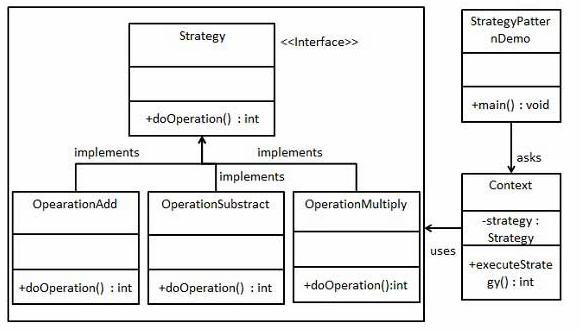

# 策略模式
在策略模式（Strategy Pattern）中，一个类的行为或其算法可以在运行时更改。这种类型的设计模式属于行为型模式。
（感觉和模板模式有点像）
## 一、主要解决
在有多种算法相似的情况下，使用 if...else 所带来的复杂和难以维护。

## 二、优点
+ 算法可以自由切换
+ 避免使用多重条件判断
+ 扩展性好

## 三、缺点
+ 策略类会增多
+ 所有的类要对外暴露

## 四、结构

## 五、例子

1. 36计
2. 旅游出行方式
3. checksum的计算